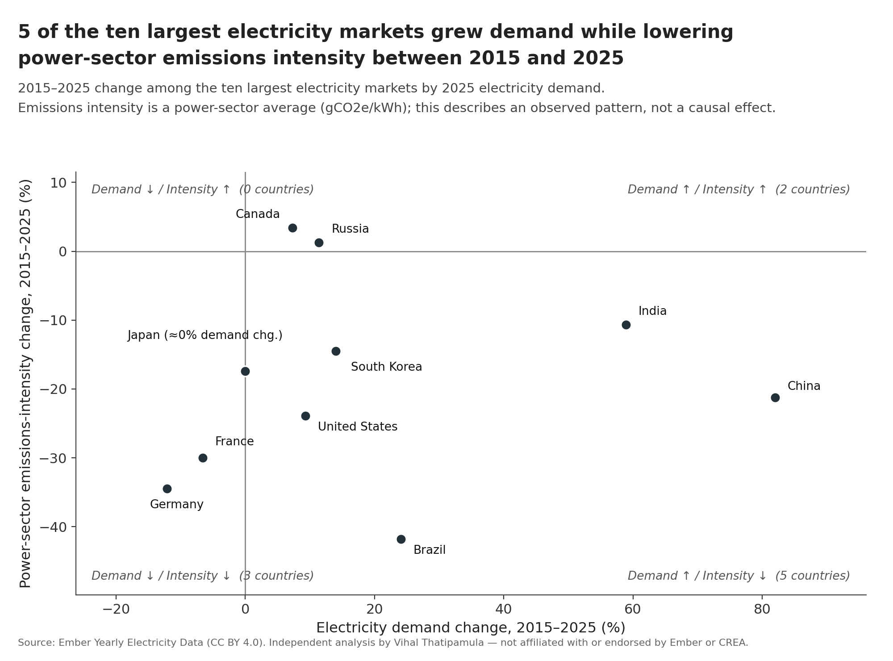
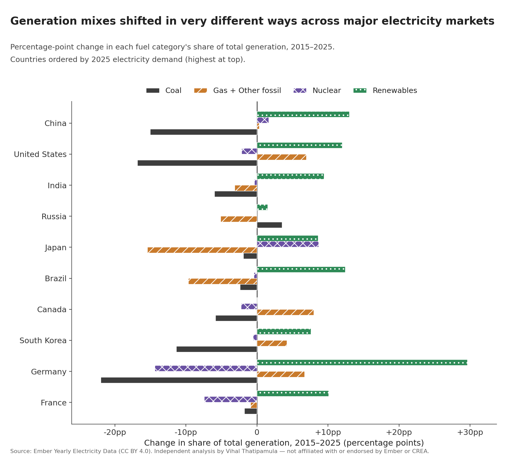
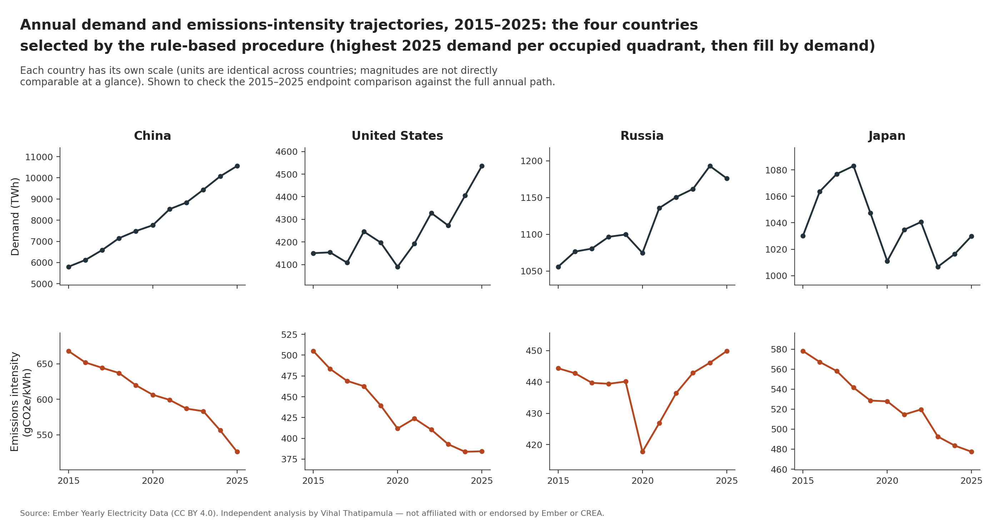

# Electricity Demand Growth and Power-Sector Emissions Intensity (2015–2025)

This repository analyzes the relationship between electricity demand growth and power-sector carbon emissions intensity across the world's ten largest electricity markets from 2015 to 2025. Using historical generation data from Ember, the project examines whether major power systems lowered their emissions per kilowatt-hour while accommodating rising demand, and explores how underlying generation mixes evolved.

Five of the ten largest electricity markets—China, the United States, India, Brazil, and South Korea—increased electricity demand while simultaneously reducing power-sector emissions intensity. However, lowering emissions intensity did not guarantee lower absolute carbon emissions: in rapidly expanding power systems like China and India, absolute coal generation and total emissions continued to rise.

---

## Research Question

**Among the world's ten largest electricity markets, which countries increased electricity demand while reducing the carbon intensity of power generation between 2015 and 2025 — and which did not?**

*Note: This is a descriptive comparison based on observed generation data; it does not estimate the causal impact of specific policies or technologies.*

---

## Key Findings

1. **Five of the ten markets grew demand while lowering emissions intensity.**
   China (demand +81.98%, intensity −21.22%), the United States (+9.28%, −23.87%), India (+58.92%, −10.69%), Brazil (+24.06%, −41.78%), and South Korea (+14.03%, −14.46%) all achieved simultaneous demand expansion and emissions intensity reduction. The remaining five markets either grew demand with rising intensity (Russia and Canada) or saw flat/falling demand alongside lower intensity (Germany, France, and Japan).

2. **Emissions intensity is distinct from total emissions (China and India case studies).**
   While China cut its coal share of generation by 15.02 percentage points (69.6% → 54.6%), absolute coal generation grew 42.66% (4,046 → 5,772 TWh), driving total power-sector emissions up 43.31% (3,884 → 5,566 MtCO2e). Similarly, India reduced its coal share by 5.98 percentage points, but absolute coal output grew 46.46% (1,007 → 1,474 TWh) and total emissions rose 41.85% (984 → 1,396 MtCO2e). A shrinking fossil share in a rapidly expanding grid does not necessarily translate to lower absolute emissions. Of the five demand-up/intensity-down countries, only the United States, Brazil, and South Korea reduced total power emissions.

3. **Countries followed distinct generation-mix pathways to reduce emissions intensity.**
   - **Germany** achieved a −34.47% intensity reduction by expanding renewables (+29.61 percentage points) while reducing coal (−21.95 pp) and nuclear (−14.36 pp).
   - **United States** cut intensity by −23.87% through a combination of renewable growth (+12.01 pp), coal reduction (−16.81 pp), and natural gas expansion (+6.95 pp).
   - **Brazil** led all markets with a −41.78% intensity reduction, supported by renewable energy expansion (+8.86 pp) and hydro availability.

4. **Russia and Canada recorded modest intensity increases under different mix dynamics.**
   - **Canada** saw demand grow +7.33% and intensity rise +3.40%, as gas generation expanded (+8.00 pp) to replace coal (−5.83 pp) with flat renewable share (+0.05 pp).
   - **Russia** recorded +11.38% demand growth and +1.24% intensity increase, driven by a slight rise in coal share (+3.55 pp) and falling gas share (−5.10 pp).

5. **Japan maintained roughly flat demand with falling emissions intensity.**
   Japan's demand remained essentially flat (−0.01%), while emissions intensity dropped −17.43%, supported by the progressive restart of nuclear capacity (+8.70 pp share).

---

## Visualizations

### 1. Electricity Demand Growth vs. Emissions-Intensity Change (2015–2025)

*Figure 1: Quadrant chart mapping relative demand change against relative emissions-intensity change for the 10 largest electricity markets.*

### 2. Generation-Mix Transition by Fuel Category (2015–2025)

*Figure 2: Percentage-point shifts in generation share across Coal, Gas + Other fossil, Nuclear, and Renewables.*

### 3. Annual Demand and Intensity Trajectories (2015–2025)

*Figure 3: 11-year annual trajectories for four representative markets (China, US, Russia, Japan) confirming that endpoint changes reflect consistent multi-year trends rather than single-year anomalies.*

---

## Data

- **Source:** [Ember Yearly Electricity Data](https://ember-energy.org/data/yearly-electricity-data/) (CC BY 4.0)
- **Timeframe:** 2015–2025
- **Selected Markets:** Top 10 country-level entities by 2025 electricity demand: China, United States, India, Russia, Japan, Brazil, Canada, South Korea, Germany, and France.
- **Key Metrics:**
  - **Demand (TWh):** Gross generation plus net imports.
  - **Emissions Intensity (gCO2e/kWh):** Lifecycle emissions intensity for total power generation.
  - **Generation Share (%):** Proportion of total generation supplied by Coal, Gas + Other fossil, Nuclear, and Renewables.

For detailed schema and provenance details, see [`data/raw/PROVENANCE.md`](data/raw/PROVENANCE.md).

---

## Approach

1. **Data Cleaning & Filtering (`src/clean_data.py`):** Filters Ember's global dataset for country-level entities, selects the top 10 markets by 2025 electricity demand, and extracts annual series for demand, total emissions intensity, and fuel-specific generation shares from 2015 to 2025.
2. **Metric Calculation (`src/analyze.py`):** Computes 10-year percentage changes, Compound Annual Growth Rates (CAGR), fuel share percentage-point shifts, and fits 11-year linear trend lines (OLS) to verify trend consistency across the decade. Outputs results to `outputs/country_summary.csv`.
3. **Visualization (`src/visualize.py`):** Generates publication-ready figures mapping quadrant classifications, generation mix shifts, and annual trajectories.

---

## Limitations

1. **Intensity vs. Total Emissions:** Lower emissions intensity does not automatically yield lower total carbon emissions if total generation expands faster than intensity declines (as observed in China and India).
2. **Provisional 2025 Figures:** Ember's 2025 data points include provisional estimates projected from monthly data.
3. **Power Sector Scope:** This analysis strictly covers electricity generation and does not include economy-wide emissions from transport, industry, or heating.
4. **Interannual Variability:** Single-year generation mixes can be influenced by weather, hydrology, or fuel price fluctuations (checked via 11-year linear trend analysis).
5. **Descriptive Analysis:** Results highlight observed correlations and co-movements rather than causal policy effects.

---

## Running the Project

```bash
# Clone repository
git clone https://github.com/vihalthatipamula09/electricity-demand-emissions-intensity.git
cd electricity-demand-emissions-intensity

# Set up virtual environment
python -m venv .venv
source .venv/bin/activate   # On Windows: .venv\Scripts\activate

# Install dependencies
pip install -r requirements.txt

# Run analytical pipeline
python src/download_data.py
python src/clean_data.py
python src/analyze.py
python src/visualize.py
```

---

## References

- Ember (2026). *Yearly Electricity Data*. Ember Energy Research CIC. Available at: [ember-energy.org/data/yearly-electricity-data](https://ember-energy.org/data/yearly-electricity-data/)
- International Energy Agency (2026). *Electricity 2026*. IEA, Paris. Available at: [iea.org/reports/electricity-2026](https://www.iea.org/reports/electricity-2026/supply)
- Centre for Research on Energy and Clean Air (2025). *India Power Sector Review 2025*. CREA. Available at: [energyandcleanair.org](https://energyandcleanair.org/publication/india-power-sector-review-2025/)
- Fraunhofer ISE (2024). *Status Quo One Year Since Germany's Nuclear Exit*. Available at: [ise.fraunhofer.de](https://www.ise.fraunhofer.de/en/press-media/press-releases/2024/status-quo-one-year-since-germanys-nuclear-exit-renewable-capacity-expands-electricity-from-fossil-fuels-significantly-reduced.html)

---

## Author

**Vihal Thatipamula**  
Data Science Portfolio Analysis — Energy & Environmental Data Analysis
